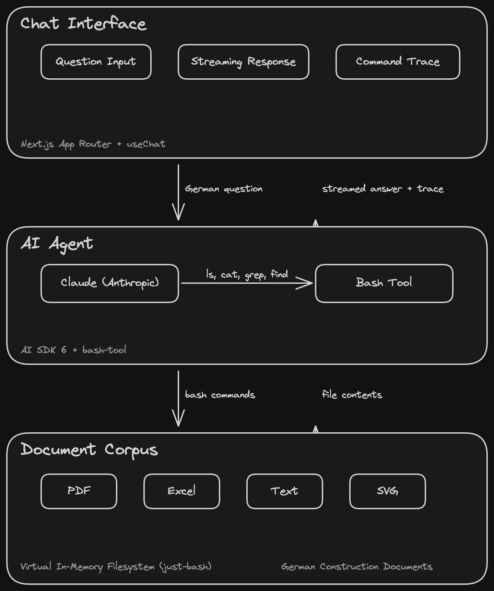

# File Agent

An AI agent that navigates construction project documents like a filesystem — thinking in bash, not vectors.

> **Note:** The application UI, all documents, and agent responses are in German, targeting German-speaking construction professionals. This README is in English.

## Architectural Thesis

For document collections with natural hierarchy (like construction projects), filesystem navigation produces more auditable results than embedding-based retrieval.

Construction projects have well-established document hierarchies — contracts, change orders, meeting minutes, punch lists, correspondence, daily logs, invoices, permits. These map naturally to folder structures with numeric prefixes:

```
/01_vertraege/          # Contracts
/02_nachtraege/         # Change orders
/03_genehmigungen/      # Permits
/04_protokolle/         # Meeting minutes
/05_maengel/            # Punch lists / defects
/06_schriftverkehr/     # Correspondence
/07_bautagebuch/        # Daily construction logs
/08_plaene/             # Technical drawings
/09_rechnungen/         # Invoices
```

The agent executes bash commands (`ls`, `cat`, `grep`, `find`) against a virtual in-memory filesystem built from these documents. Every navigation step is visible to the user — the trace IS the evidence. There is no vector database, no embeddings, no RAG pipeline. Just bash.

This approach trades recall breadth for auditability: you can see exactly which documents the agent opened, which search terms it used, and how it arrived at its answer. For domains with structured document hierarchies, this transparency is more valuable than statistical similarity scores.



## Features

- Virtual filesystem with realistic German construction documents (PDF, Excel, text, SVG drawings)
- AI agent navigates via bash commands (`ls`, `cat`, `grep`, `find`)
- Real-time streaming responses with visible command trace
- Inline citations referencing source documents
- Evaluation harness with A/B testing capability
- All documents in German construction terminology (VOB, HOAI, etc.)

## Tech Stack

| Technology | Version | Purpose |
|------------|---------|---------|
| Next.js | 16 | App Router, SSR, deployment |
| AI SDK | 6 | Agent loop, streaming, tool orchestration |
| @ai-sdk/anthropic | 3 | Claude model provider |
| just-bash + bash-tool | 2 / 1 | Virtual in-memory filesystem + bash interpreter |
| Tailwind CSS | 4 | Styling |
| Vitest | 4 | Testing |
| TypeScript | 5 | Type safety |

## Try It

Once running, try these example questions (in German):

- **"Welche Nachtraege gibt es und was ist deren aktueller Status?"** — Lists all change orders and their current status
- **"Welche Maengel sind noch nicht behoben?"** — Finds unresolved defects across punch lists
- **"Wer sind die beteiligten Nachunternehmer und welche Gewerke fuehren sie aus?"** — Identifies subcontractors and their trades

## Local Setup

```bash
git clone https://github.com/USER/file-agent.git
cd file-agent
npm install
cp .env.example .env.local
# Add your ANTHROPIC_API_KEY to .env.local
npm run dev
# Open http://localhost:3000
```

## Deployment

### Pre-deploy checks

```bash
npm run build
npm test
```

### Deploy to Vercel

Connect the GitHub repo in the [Vercel Dashboard](https://vercel.com/new), or deploy via CLI:

```bash
npx vercel deploy --prod
```

### Environment Variables

Set `ANTHROPIC_API_KEY` in Vercel Dashboard > Project Settings > Environment Variables.

### Runtime Notes

- **Edge runtime is not supported** — `just-bash` uses Node.js APIs internally. The default Node.js serverless runtime is required.
- **Timeout:** Hobby plan has a 10-second function timeout. Multi-step agent loops (8-10 steps) may exceed this. Pro plan (60s timeout) is recommended.
- **Streaming** keeps the connection alive — Vercel supports streamed responses natively.

## Project Structure

```
src/
  app/           # Next.js App Router pages and API routes
  components/    # Chat UI, tool trace, citations, example questions
  corpus/        # Virtual filesystem data and loader
  lib/agent/     # System prompt and agent configuration
  eval/          # Evaluation harness, test questions, A/B comparison
docs/            # Architecture diagrams (Excalidraw)
```
